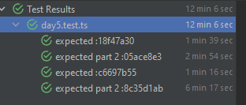

--- Day 5: How About a Nice Game of Chess? ---

You are faced with a security door designed by Easter Bunny engineers that seem to have acquired most of their security knowledge by watching hacking movies.

The eight-character password for the door is generated one character at a time by finding the MD5 hash of some Door ID (your puzzle input) and an increasing integer index (starting with 0).

A hash indicates the next character in the password if its hexadecimal representation starts with five zeroes. If it does, the sixth character in the hash is the next character of the password.

For example, if the Door ID is abc:

- The first index which produces a hash that starts with five zeroes is 3231929, which we find by hashing abc3231929; the sixth character of the hash, and thus the first character of the password, is 1.
- 5017308 produces the next interesting hash, which starts with 000008f82..., so the second character of the password is 8.
- The third time a hash starts with five zeroes is for abc5278568, discovering the character f.

In this example, after continuing this search a total of eight times, the password is 18f47a30.

Given the actual Door ID, what is the password?

--- Part Two ---

As the door slides open, you are presented with a second door that uses a slightly more inspired security mechanism. Clearly unimpressed by the last version (in what movie is the password decrypted in order?!), the Easter Bunny engineers have worked out a better solution.

Instead of simply filling in the password from left to right, the hash now also indicates the position within the password to fill. You still look for hashes that begin with five zeroes; however, now, the sixth character represents the position (0-7), and the seventh character is the character to put in that position.

A hash result of 000001f means that f is the second character in the password. Use only the first result for each position, and ignore invalid positions.

For example, if the Door ID is abc:

- The first interesting hash is from abc3231929, which produces 0000015...; so, 5 goes in position 1: _5______.
- In the previous method, 5017308 produced an interesting hash; however, it is ignored, because it specifies an invalid position (8).
- The second interesting hash is at index 5357525, which produces 000004e...; so, e goes in position 4: _5__e___.

You almost choke on your popcorn as the final character falls into place, producing the password 05ace8e3.

Given the actual Door ID and this new method, what is the password? Be extra proud of your solution if it uses a cinematic "decrypting" animation.

